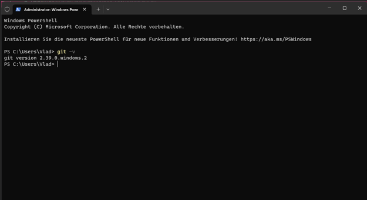
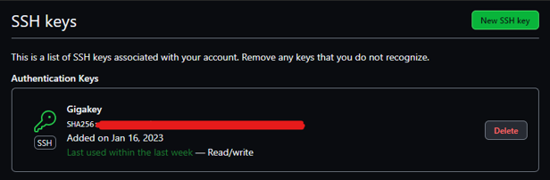
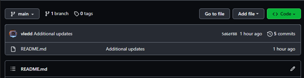
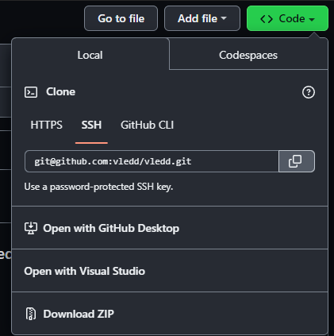
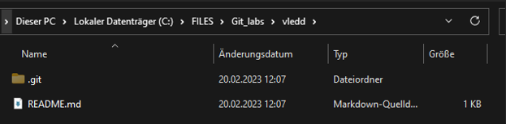
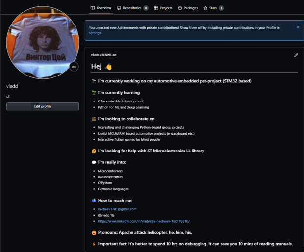

**Мета роботи**: У даній лабораторній роботі нам потрібно ознайомитися із системою контролю git. Для цього нам треба буде інсталювати її собі на ПК та створити тестовий репозиторій, щоб ознайомитися із базовими принципами роботи.

**Виконання роботи:**

1. Спочатку реєструємося на GitHub. Після реєстрації та вказання своєї адреси пошти, а також паролю, ми успішно створюємо наш акаунт.

Рисунок 1.1 – Аватар, ім'я користувача та статус акаунту

2. Встановимо менеджер пакетів для Windowsпід назвою CHOCOLATEY. Це можна зробити, запустивши оболонку PowerShell, надавши їй права адміністратора. В PowerShell треба ввести наступну команду.

Set-ExecutionPolicy Bypass -Scope Process -Force; [System.Net.ServicePointManager]::SecurityProtocol = [System.Net.ServicePointManager]::SecurityProtocol -bor 3072; iex ((New-Object System.Net.WebClient).DownloadString('https://chocolatey.org/install.ps1'))

3. За допомогою менеджеру пакетів встановлюємо git. Це робиться наступною командою.

choco install git -y

4. Перевіряємо вірність встановлення git.

Рисунок 1.2 – Перевірка версії git

Git був встановлений коректно.

5. Зробимо глобальні налаштування git на нашому ПК, щоб він коректно розпізнавав наш обліковий запис. Це робиться двома командами.

git config --global user.name "vledd"

git config --global user.email [nechaev1701@gmail.com](mailto:nechaev1701@gmail.com)

6. Далі потрібно згенерувати ключ для SSH доступу до репозиторію. Це робиться наступною командою:

ssh-keygen -t ed25519 -C "[nechaev1701@gmail.com](mailto:nechaev1701@gmail.com)"

Програма запропонує нам назвати ключ та за бажанням обрати директорію, відмінну від стандартної. Також можна задати пароль для даного ключа. Після створення ключа, у папці C:\Users\Vlad\\.ssh потрібно знайти публічну версію даного ключа та додати її до GitHub. Це буде виглядати наступним чином.

Рисунок 1.3 – Доданий SSH ключ

7. Створимо новий репозиторій на сайті GitHub. Треба зробити його відкритим, а також назвати згідно нашого імені користувача, щоб він міг відображатися у профілі. Треба не забути додати Readme.md. Репозиторій виглядатиме приблизно наступним чином.

Рисунок 1.4 – Створений репозиторій

8. Скопіюємо SSH ключ із нашого репозиторію.

Рисунок 1.5 – Місцезнаходження ключа

9. У Git Bash за допомогою консольних команд переходимо в потрібну папку і пишемо команду

git clone [git@github.com:vledd/vledd.git](mailto:git@github.com:vledd/vledd.git)

Може знадобитися введення паролю, якщо він заданий для ключа. Переконаємося, що клонування відбулося успішно.

Рисунок 1.6 – Перевірка наявності локальної копії репозиторію

10. Відкриємо файл README.md за допомогою, наприклад, VSCode і відредагуємо опис нашого профілю. Після редагування пишемо такі команди.

git add .

git commit

git push

На другій команді відкриється наш текстовий редактор і можна буде ввести коментар до commit.

11. Розглянемо отриманий результат.

Рисунок 1.7 – Результат роботи над README.md

Висновки

У даній лабораторній роботі ми ознайомилися із системою контроля версій Git а також із сервісом GitHub. На практиці ми дізналися логіку роботи Git та основні команди для роботи із репозиторієм. Також ми створили ключ SSH і додали його в наш профіль, що аутентифікувати наш ПК. Наостанок ми створили невеличке резюме для нашого профілю